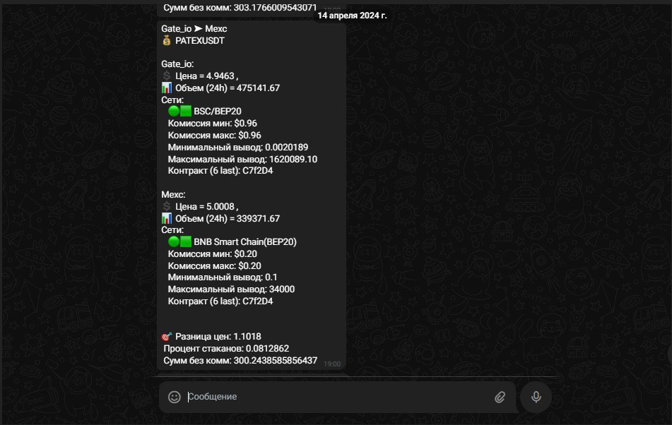

# CEX Flash Arbitrage Bot

[](https://www.python.org/downloads/)
[](https://opensource.org/licenses/MIT)

Высокопроизводительный асинхронный бот для арбитража на централизованных биржах (CEX). Отслеживает расхождения цен на множестве площадок в реальном времени и отправляет уведомления через Telegram.

[Русская версия](README_RU.md) | [English](README.md)



---

## 🚀 Возможности

*   **Поддержка множества бирж:** Интеграция с Bybit, OKX, Gate.io, KuCoin, Mexc, CoinW.
*   **Асинхронная архитектура:** Построен на `asyncio` для минимизации задержек при получении данных.
*   **Оповещения в реальном времени:** Мгновенные уведомления через Telegram Bot API.
*   **Гибкая настройка:** Настройка спредов, фильтров объема и таймеров через UI.
*   **Экспериментальная стратегия:** Включает модуль логики треугольного арбитража (в стадии эксперимента).

---

## 🔔 Уведомления

Бот отправляет уведомления в Telegram в реальном времени, содержащие следующую информацию:

*   **Направление обмена:** Показывает связку бирж (например, `Binance ➤ Bybit`).
*   **Монета:** Актив для арбитража (например, `BTCUSDT`).
*   **Цена и Объем:** Детальная цена и суточный объем (24h) для обеих бирж для оценки ликвидности.
*   **Спред:** Расчетная прибыль в процентах.

---

## ⚡ Примечание о производительности

> **Дисклеймер:** Это версия **Proof-of-Concept (PoC)**, созданная для демонстрации архитектурной логики CEX-арбитража.
>
> Текущий асинхронный движок функционален, но оптимизирован в первую очередь для читаемости кода и демонстрации идеи. В реальной среде высокочастотного трейдинга (HFT) ядро можно ускорить в **10 раз** и более за счет:
> *   Рефакторинга критических путей на Rust или Cython.
> *   Использования прямых WebSocket-соединений вместо опроса REST API.
> *   Перехода на низкоуровневые сетевые библиотеки.

---

## 🛠 Установка

1.  **Клонирование репозитория:**
    ```bash
    git clone https://github.com/yourusername/cex-flash-arbitrage.git
    cd cex-flash-arbitrage
    ```

2.  **Установка зависимостей:**
    ```bash
    pip install -r requirements.txt
    ```

3.  **Настройка:**
    Скопируйте пример файла конфигурации и укажите свои API ключи:
    ```bash
    cp .env.example .env
    ```
    Отредактируйте `.env`, добавив ключи бирж и токен Telegram бота.

---

## 🧩 Структура проекта

*   `Core/`: Основная логика обработки данных.
*   `exchange/`: Обертки API для отдельных бирж (Bybit, OKX и др.).
*   `TelBot/`: Интерфейс Telegram бота и обработчики.
*   `strategies/`: Арбитражные стратегии, включая экспериментальную треугольную логику.

---

## ⚠️ Экспериментально: Треугольный Арбитраж

Файл `strategies/triangular_logic.py` содержит математическое ядро для поиска цепочек треугольного арбитража.
> **Примечание:** Данная стратегия является экспериментальной. Высокочастотный треугольный арбитраж на CEX подвержен жестким лимитам на запросы (rate limits) и задержкам исполнения, что может влиять на доходность в реальных условиях.

---

## 📝 Лицензия

MIT License. См. [LICENSE](LICENSE) для получения дополнительной информации.
